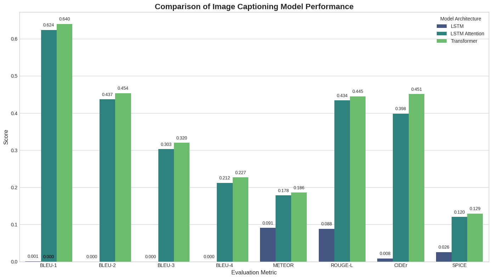
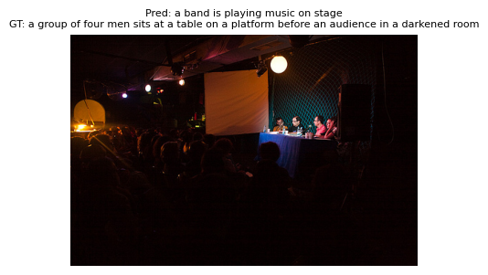
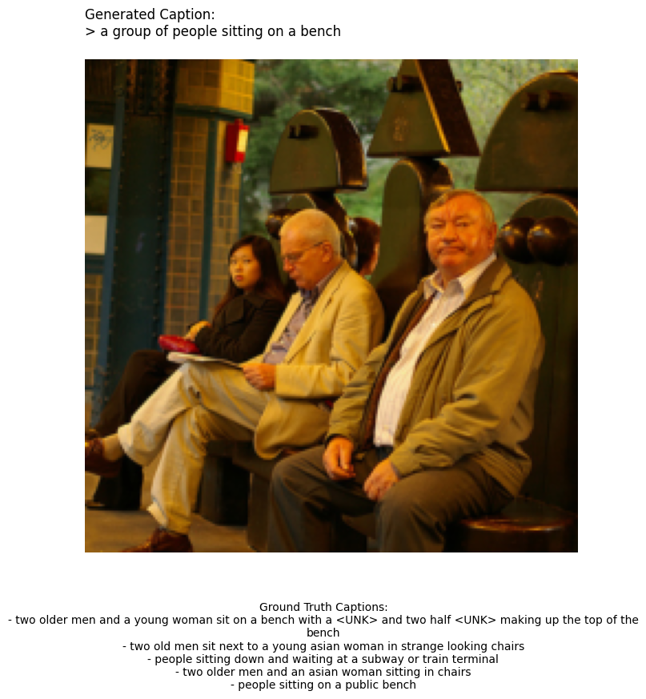
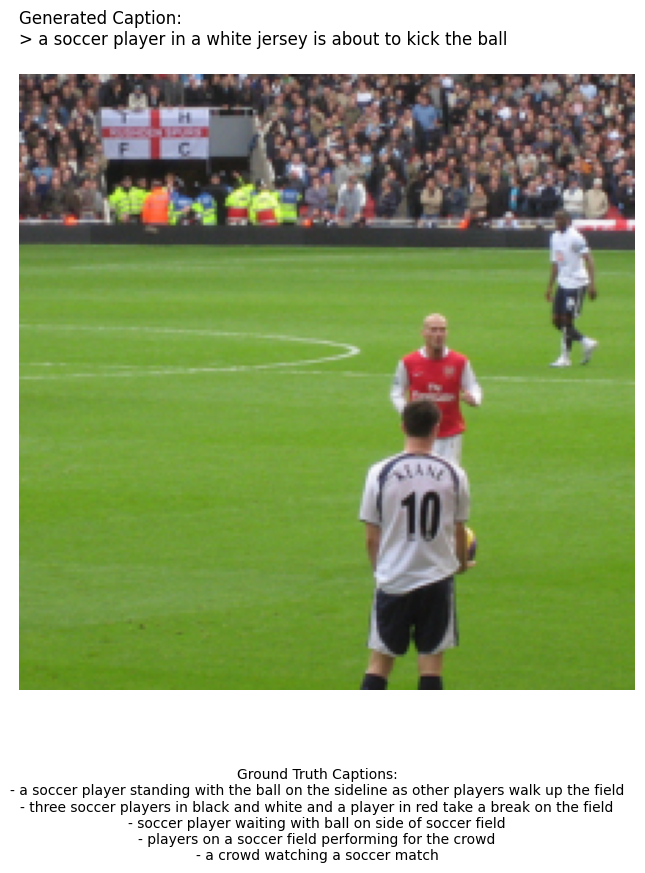

# Captioneer: A Comparative Study of Image Captioning Models From LSTMs to Transformers

This project provides a comprehensive, hands-on comparison of different neural network architectures for the task of image captioning. Starting with a simple LSTM baseline, the complexity is incrementally increased by adding an attention mechanism and finally implementing a modern Transformer-based decoder with pre-trained embeddings.

The primary goal is to analyze and quantify the performance gains offered by each architectural advancement.

---

## Table of Contents

- [Project Overview](#project-overview)
- [Models Compared](#models-compared)
- [Final Results](#final-results)
  - [Quantitative Analysis (Metrics)](#quantitative-analysis-metrics)
  - [Qualitative Analysis (Examples)](#qualitative-analysis-examples)
- [Analysis and Conclusion](#analysis-and-conclusion)
- [Setup and Usage](#setup-and-usage)
  - [1. Prerequisites](#1-prerequisites)
  - [2. Data Setup](#2-data-setup)
  - [3. Preprocessing](#3-preprocessing)
  - [4. Training the Models](#4-training-the-models)
  - [5. Final Evaluation](#5-final-evaluation)
- [File Structure](#file-structure)
- [Technologies Used](#technologies-used)
- [License](#license)

---

## Project Overview

Image captioning is a task that bridges the gap between computer vision and natural language processing. This project aims to methodically evaluate three distinct architectures on the **Flickr30k dataset**:

1.  **A simple LSTM-based decoder** to establish a performance baseline.
2.  **An LSTM decoder enhanced with a Bahdanau-style attention mechanism** to allow the model to focus on relevant parts of the image.
3.  **A modern Transformer decoder** that leverages pre-trained word embeddings from **DistilBERT**, representing a state-of-the-art approach.

By comparing these models, we can clearly observe the impact of architectural innovations on both the quantitative metrics (BLEU, METEOR, etc.) and the qualitative richness of the generated captions.

## Models Compared

### 1. LSTM (Baseline)
-   **Encoder:** An identity layer that passes pre-extracted ResNet-50 features (2048-dim vector) to the decoder. This approach does not use spatial information.
-   **Decoder:** A simple LSTM network that uses the single image feature vector to initialize its hidden state. It generates captions using greedy decode, one word at a time.
-   **Purpose:** To set a performance floor and demonstrate the limitations of a non-attentive model.

### 2. LSTM with Attention
-   **Encoder:** A ResNet-50 CNN that extracts spatial features.
-   **Decoder:** An LSTM network equipped with an **attention mechanism**. At each step of the caption generation, the decoder learns to focus on different parts of the image feature grid, allowing it to generate more contextually relevant words.
-   **Purpose:** To show the significant performance boost provided by the attention mechanism.

### 3. Transformer with Pre-trained Embeddings
-   **Encoder:** A ResNet-50 CNN providing spatial image features, similar to the attention model.
-   **Decoder:** A custom-built Transformer decoder (using `nn.TransformerDecoderLayer`) that is trained from scratch.
-   **Embeddings:** The decoder's word embedding layer is initialized with pre-trained weights from Hugging Face's **`distilbert-base-uncased`**.
-   **Purpose:** To demonstrate the performance of a modern architecture that combines pre-trained vision and language knowledge with a custom-trained sequence-to-sequence model.

---

## Final Results

The models were trained and evaluated on the Flickr30k dataset. The final comparison was performed on the test set, judging each model's generated caption against all 5 ground-truth references for each image.

### Quantitative Analysis (Metrics)

The following chart summarizes the performance of each model across standard image captioning metrics. Higher is better for all metrics.

 

 

A visual comparison of the key metrics highlights the performance jump between architectures:

### Qualitative Analysis (Examples)

Below are some randomly selected examples from the test set, showing the captions generated by each model.

**Example 1 (Baseline):**
 

 

**Example 2 (LSTM + Attention):**
 

 

**Example 3 (Transformer):**
 

 

---

## Analysis and Conclusion

The results clearly demonstrate the evolution of image captioning models:

-   The **Baseline LSTM** struggled significantly, often producing single-word or grammatically poor captions. This was expected, as it lacks a mechanism to focus on different parts of the image as it generates the sequence, leading to a BLEU-4 score near zero.
-   The **LSTM with Attention** was a massive improvement. By learning to focus on relevant image regions, it was able to generate much more coherent and accurate captions, achieving a respectable **BLEU-4 score of 0.205**.
-   The **Transformer model** provided a further step up, achieving the highest scores across all major metrics with a **BLEU-4 of 0.224**. The combination of the powerful Transformer architecture and the rich linguistic prior from DistilBERT's embeddings allowed it to produce the most descriptive and accurate captions.

This study confirms that architectural advancements, particularly the attention mechanism and the Transformer, provide substantial and measurable improvements in the complex task of image captioning.

---
