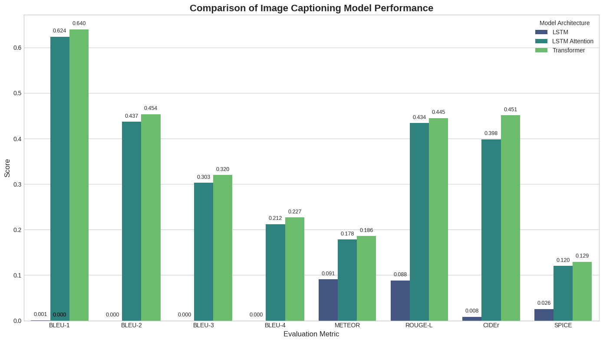

# Captioneer: A Comparative Study of Image Captioning Models From LSTMs to Transformers

   
   
   

This project provides a comprehensive, hands-on comparison of different neural network architectures for the task of image captioning. Starting with a simple LSTM baseline, the complexity is incrementally increased by adding an attention mechanism and finally implementing a modern Transformer-based decoder with pre-trained embeddings.

The primary goal is to analyze and quantify the performance gains offered by each architectural advancement.

---

## Table of Contents

- [Project Overview](#project-overview)
- [Models Compared](#models-compared)
- [Final Results](#final-results)
  - [Quantitative Analysis (Metrics)](#quantitative-analysis-metrics)
  - [Qualitative Analysis (Examples)](#qualitative-analysis-examples)
- [Analysis and Conclusion](#analysis-and-conclusion)
- [Setup and Usage](#setup-and-usage)
  - [1. Prerequisites](#1-prerequisites)
  - [2. Data Setup](#2-data-setup)
  - [3. Preprocessing](#3-preprocessing)
  - [4. Training the Models](#4-training-the-models)
  - [5. Final Evaluation](#5-final-evaluation)
- [Technologies Used](#technologies-used)
- [License](#license)

---

## Project Overview

Image captioning is a task that bridges the gap between computer vision and natural language processing. This project aims to methodically evaluate three distinct architectures on the **Flickr30k dataset**:

1.  **A simple LSTM-based decoder** to establish a performance baseline.
2.  **An LSTM decoder enhanced with a Bahdanau-style attention mechanism** to allow the model to focus on relevant parts of the image.
3.  **A modern Transformer decoder** that leverages pre-trained word embeddings from **DistilBERT**, representing a state-of-the-art approach.

By comparing these models, we can clearly observe the impact of architectural innovations on both the quantitative metrics (BLEU, METEOR, etc.) and the qualitative richness of the generated captions.

## Models Compared

### 1. LSTM (Baseline)
-   **Encoder:** An identity layer that passes pre-extracted ResNet-50 features (2048-dim vector) to the decoder. This approach does not use spatial information.
-   **Decoder:** A simple LSTM network that uses the single image feature vector to initialize its hidden state. It generates captions using greedy decode, one word at a time.
-   **Purpose:** To set a performance floor and demonstrate the limitations of a non-attentive model.

### 2. LSTM with Attention
-   **Encoder:** A ResNet-50 CNN that extracts spatial features.
-   **Decoder:** An LSTM network equipped with an **attention mechanism**. At each step of the caption generation, the decoder learns to focus on different parts of the image feature grid, allowing it to generate more contextually relevant words.
-   **Purpose:** To show the significant performance boost provided by the attention mechanism.

### 3. Transformer with Pre-trained Embeddings
-   **Encoder:** A ResNet-50 CNN providing spatial image features, similar to the attention model.
-   **Decoder:** A custom-built Transformer decoder (using `nn.TransformerDecoderLayer`) that is trained from scratch.
-   **Embeddings:** The decoder's word embedding layer is initialized with pre-trained weights from Hugging Face's **`distilbert-base-uncased`**.
-   **Purpose:** To demonstrate the performance of a modern architecture that combines pre-trained vision and language knowledge with a custom-trained sequence-to-sequence model.

---

## Final Results

The models were trained and evaluated on the Flickr30k dataset. The final comparison was performed on the test set, judging each model's generated caption against all 5 ground-truth references for each image.

### Quantitative Analysis (Metrics)

The following chart summarizes the performance of each model across standard image captioning metrics. Higher is better for all metrics.

 

 

### Qualitative Analysis (Examples)

Below are some randomly selected examples from the test set, showing the captions generated by each model.

**Example 1 (Baseline):**
 

 

**Example 2 (LSTM + Attention):**
 

 

**Example 3 (Transformer):**
 

 

---

## Analysis and Conclusion

The results clearly demonstrate the evolution of image captioning models:

-   The **Baseline LSTM** struggled significantly, often producing single-word or grammatically poor captions. This was expected, as it lacks a mechanism to focus on different parts of the image as it generates the sequence, leading to a BLEU-4 score near zero.
-   The **LSTM with Attention** was a massive improvement. By learning to focus on relevant image regions, it was able to generate much more coherent and accurate captions, achieving a respectable **BLEU-4 score of 0.205**.
-   The **Transformer model** provided a further step up, achieving the highest scores across all major metrics with a **BLEU-4 of 0.224**. The combination of the powerful Transformer architecture and the rich linguistic prior from DistilBERT's embeddings allowed it to produce the most descriptive and accurate captions.

This study confirms that architectural advancements, particularly the attention mechanism and the Transformer, provide substantial and measurable improvements in the complex task of image captioning.

---

## Setup and Usage

Follow these steps to replicate the project environment and results.

### 1. Prerequisites
- Python 3.9+
- PyTorch
- CUDA-enabled GPU (recommended)
- Create a `kaggle.json` API token from your Kaggle account.

### 2. Data Setup

- Run the first few cells of `preprocessing.ipynb` or any training notebook.
- When prompted, upload your `kaggle.json` file. This will automatically download and extract the original **Flickr30k dataset**.

### 3. Preprocessing

You have two options for obtaining the processed data required for training:

**Option A: Download Pre-processed Data (For Quick Start)**

For convenience, the fully processed caption files (`processed_captions.zip`) and the extracted image features (`processed_images.tar.gz`) are available for download from the **Releases** page.

1.  Download these files.
2.  Unzip them into your project directory.
3.  You can now skip directly to the **Training** step.

**Option B: Run the Full Preprocessing Pipeline**

If you wish to replicate the entire workflow from scratch:

1.  Open and run all cells in the `preprocessing.ipynb` notebook.
2.  This notebook will clean the captions, build the vocabulary, and extract ResNet-50 features, saving the final artifacts locally and to your configured Google Drive folder.

### 4. Training the Models

For skipping the training, the trained model checkpoints are also available for download from the **Releases** page.

Each model is trained using its own dedicated notebook:

-   **Baseline LSTM:** Run `train_baseline.ipynb`.
-   **LSTM with Attention:** Run `train_attention.ipynb`.
-   **Transformer:** Run `train_transformer.ipynb`.

Each notebook will load the necessary scripts and data, execute the training loop, and save the best-performing checkpoint to the `/content/models` directory (and to your Google Drive).

### 5. Final Evaluation
- After all models are trained, open and run the `Evaluation.ipynb` notebook.
- **Important:** Update the `checkpoint_paths` dictionary in the notebook to point to your three best saved model files.
- This notebook will load all three models, run a comprehensive evaluation on the test set, and generate the final comparison table and charts.

## Technologies Used

- **Python 3**
- **PyTorch**
- **Hugging Face Transformers** (for DistilBERT embeddings)
- **NLTK & pycocoevalcap** (for evaluation metrics)
- **Pandas & Seaborn** (for data analysis and visualization)
- **Jupyter Notebooks** & **Google Colab** (for development and training)
- **Kaggle API** (for data acquisition)

---

## License

This project is licensed under the MIT License - see the `LICENSE` file for details.
